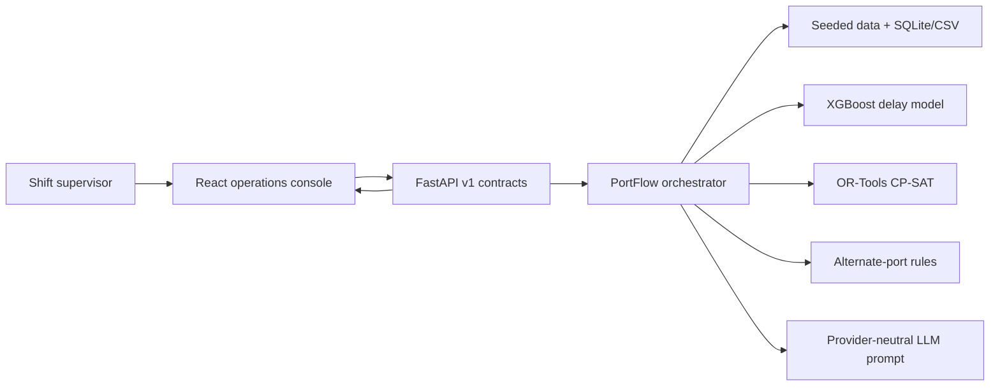

# Architecture

| Component | Technology | Responsibility |
| --- | --- | --- |
| Dashboard | React, TypeScript, Vite | 72-hour timeline and hotspot heatmap |
| API | FastAPI, Pydantic | Stable versioned response contracts |
| Prediction | XGBoost | Vessel delay estimate and explainability artifact |
| Scheduling | OR-Tools CP-SAT | Compatible, non-overlapping berth assignment |
| Routing | Python rules | Distance/capacity alternate-port ranking |
| Data | Python, SQLite, CSV | Reproducible operational scenario |
| Briefing | LLM-ready messages | Supervisor-readable explanation |

Data moves from the seeded operational dataset into predictions and scores,
then into constrained assignments and routing recommendations. The API
serializes the outputs for the dashboard. No credentials are stored in the
repository; model-provider calls are intentionally outside the core prompt
builder.

The current local demo is single-process and deterministic by seed. The API
contracts can later sit behind a worker queue and persistent operational
database without changing the frontend response shapes.
